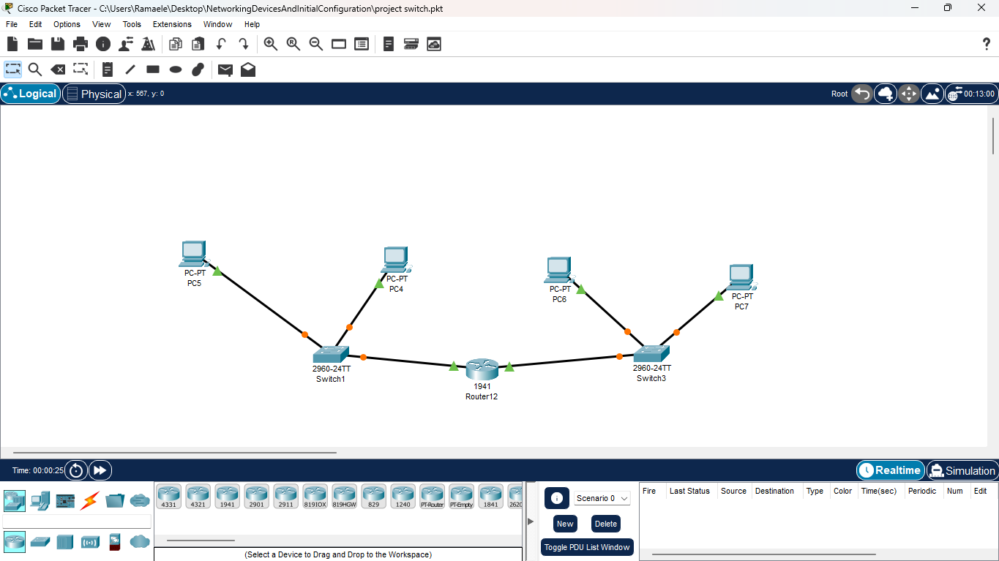

# Multi-LAN Packet Tracer Lab


## Project Overview

This project simulates a small-scale network environment using Cisco Packet Tracer. It consists of four separate Local Area Networks (LANs), each with two PCs and a switch, interconnected through central routers. The objective is to practice network design, IP addressing, and device configuration in a controlled lab setting.

---

## Network Topology

The network consists of the following components:

- **LAN 1:** 2 PCs connected to Switch1
- **LAN 2:** 2 PCs connected to Switch2
- **LAN 3:** 2 PCs connected to Switch3
- **LAN 4:** 2 PCs connected to Switch4
- **Routers:** 2 Cisco routers to interconnect LANs

**IP Addressing Scheme:**

| LAN  | Subnet          | Router Gateway  |
|------|----------------|----------------|
| LAN1 | 192.168.10.0/24 | 192.168.10.1   |
| LAN2 | 192.168.20.0/24 | 192.168.20.1   |
| LAN3 | 192.168.30.0/24 | 192.168.30.1   |
| LAN4 | 192.168.40.0/24 | 192.168.40.1   |

**Router-to-Router Link:**  
- Subnet: 10.0.0.0/30  
- Router1: 10.0.0.1  
- Router2: 10.0.0.2  

---

## Components Used

- Cisco Packet Tracer  
- Cisco 1941 Routers  
- Cisco Switches (PT model)  
- PCs (PT Desktop)

---

## Installation / Setup Instructions

1. **Download Packet Tracer**  
   - Ensure Cisco Packet Tracer is installed (version 8.x recommended).  
   - Download from the official Cisco Networking Academy website: [https://www.netacad.com/](https://www.netacad.com/)

2. **Open the Project File**  
   - Open the `.pkt` file included in this repository.  
   - The file contains all switches, PCs, and routers pre-placed according to the topology.

3. **Configure Routers**  
   - Open the CLI of each router and configure interfaces with the IP addresses specified in the IP addressing table.  
   - Use the `no shutdown` command to activate each interface.  
   - Example configuration for Router1 (LAN1 & LAN2):  

   ```bash
   enable
   configure terminal
   interface GigabitEthernet0/0
    ip address 192.168.10.1 255.255.255.0
    no shutdown
   exit
   interface GigabitEthernet0/1
    ip address 192.168.20.1 255.255.255.0
    no shutdown
   exit
   interface GigabitEthernet0/2
    ip address 10.0.0.1 255.255.255.252
    no shutdown
   exit
   ip routing
   end
   copy running-config startup-config
